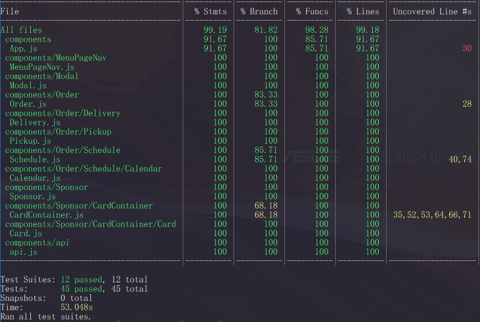

# Grubhub Clone
> Microservice server rendering Time component / Sponsored component



Unit tests last updated at July 18

- Developed a microservice server redering two components; <Time /> and <Sponsored />
- Optimized with code-splitting and achieved a 100% audit score on Chrome Lighthouse
- Set up Nginx as reserve proxy and deployed on Digital Ocean Ubuntu 18.04
- Performed unit testing with Jest & Enzyme and achieved a 99% code coverage
- Automated the CI/CD process wiht CircleCI (Jest for CI / Heroku for CD)

## Deployment

* [Reverse Proxy](http://138.68.22.104/?id=10) - Nginx server connecting all the microservice servers on a single page
* [Microservice](https://time-sponsored.herokuapp.com/restaurants/time_sponsored/?id=10) - Express server serving bundle.js

## Related Projects

* [Kathleen - Nav, About sections](https://github.com/hrla29-group-targaryen/nav-about)
* [Calvin - Menu, Cart sections](https://github.com/hrla29-group-targaryen/menu-cart)
* [Ramin - Review, Footer sections](https://github.com/hrla29-group-targaryen/reviews)

### Usage

```
git clone https://github.com/hrla29-group-targaryen/time-sponsored-optimized.git
cd time-sponsored-optimized
cd client
npm install
npm run build
```

### Requirements

You need to install Nodejs.

### Development Tools

* [react.js](https://www.npmjs.com/package/react) - The official React.js website
* [express.js](https://www.npmjs.com/package/express) - The official Express.js website
* [mongoose](https://www.npmjs.com/package/mongoose) - The official Mongoose website
* [webpack 4](https://www.npmjs.com/package/webpack) - The official Webpack website

## Meta Data

James Jongho Kim 
- [Github](https://github.com/april9288) - This is my Github page


