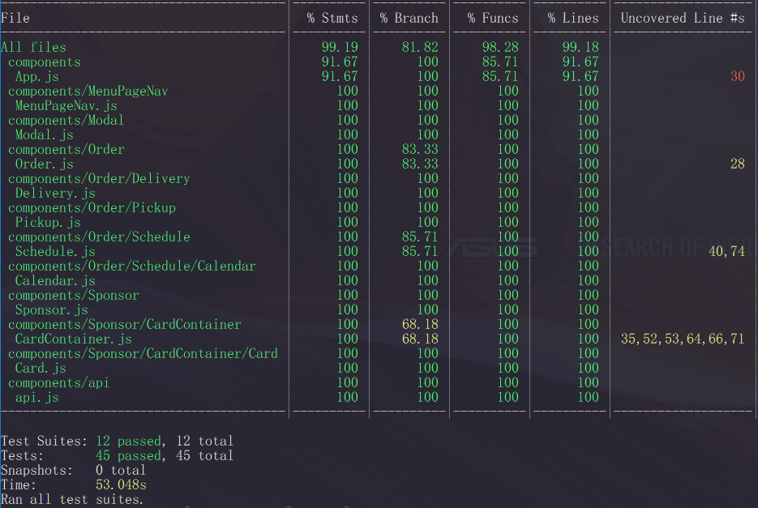

# FEC Service Server (James Kim)
> This server is rendering two different sections



Unit tests last updated at May 28

This service server is responsible for rendering two different sections. One is a component that has a little button. If you click it, then a popup window will show up on top of the current page. This is something called a portal. This part was little bit tricky because it has to have an additional "div" in the index.html file. It wasn't easy to come up with without knowing the concept of react portals. 

The other section is a component that has a slideshow like a carousel. It shows a list of sponsored restaurants. First 3 restaurants will be shown at first, and then when user clicks the next button, then it slides to the next 3 restaurants.

## Related Projects

* [Nav, About sections](https://github.com/hrla29-group-targaryen/nav-about)
* [Menu, Cart sections](https://github.com/hrla29-group-targaryen/menu-cart)
* [Review, Footer sections](https://github.com/hrla29-group-targaryen/reviews)

### Usage

```
git clone https://github.com/hrla29-group-targaryen/time-sponsored.git
cd time-sponsored
npm install
npm start
```

### Requirements

You need to install Nodejs.

### Development

* [react.js](https://www.npmjs.com/package/react) - The official React.js website
* [express.js](https://www.npmjs.com/package/express) - The official Express.js website
* [mongoose](https://www.npmjs.com/package/mongoose) - The official Mongoose website
* [webpack](https://www.npmjs.com/package/webpack) - The official Webpack website

## Meta

James Jongho Kim 
- [Github](https://github.com/april9288) - This is my Github page


